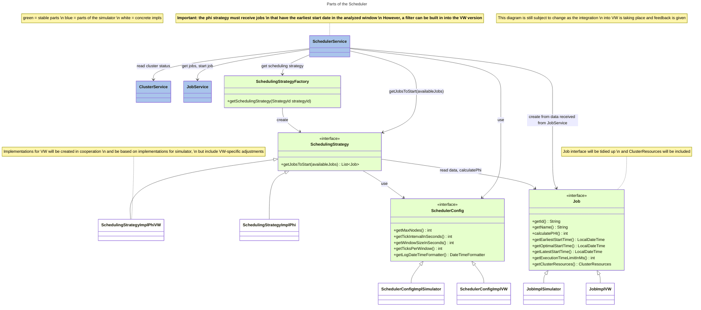

# taas-job-scheduler

This repository contains the code for my bachelor thesis "Avoiding resource usage peaks in an industrial Testing-as-a-Service Application".
It consist of two parts:

- A scheduler
- A simulator

## Scheduler

The scheduler operates on jobs that define an earliest start time, a latest start time, maximum runtime and a resource requirements.
The scheduler tries to schedule the jobs in a way that the resource usage is as constant as possible.
It is written in Java and Quarkus and can be run as a standalone service and communicate with a job service (a service storing and executing the jobs) via REST.

The scheduler leverages abstractions to allow for (semi)easy swapping of specific parts, like the strategy or cluster/jobs services (API adapters). Each part of the system has its own subfolder (like scheduling_strategy, job, etc.) and the contract (interface) is defined in a file without any suffixes. A specific implementation contains a suffix in the name (f.e. JobRepository and JobRepositoryImplSimulator).
Config is a bit of an exception, but it needs to be re-worked anyway.

Scheduling service runs the scheduler ticks and invokes a selected strategy.

## Simulator

The simulator simulates a service managing jobs and a cluster executing the jobs. Via a REST API, it provides data on available jobs and the current resource usage of the cluster. The service accepts jobs and executes them on the simulated cluster when instructed to do so via an API call. The simulated cluster then simulates execution of jobs and resource usage accordingly. It also contains functions for running different test scenarios, gathering results and plotting them onto graphs. Written in TypeScript.

The plots can be viewed by starting any kind of live/web server in the /simulator/plot folder and opening the index.html file in the browser.

## Integration

## TODO

- [ ] Improvements to the strategy:
  - [ ] Adjustment of parameters in formulas
  - [ ] Inclusion of average historical job execution time in calculations
  - [x] Analysis of smaller windows to properly schedule clustered jobs
- [x] Conversion from Service to an library/script that can be integrated into an existing service instead of having to run as a separate service (solved by integration chart above)
- [ ] Reintroduction of evaluation/penalty functions (were used in testing earlier but got removed for now). Since the scheduler is stateless in the end, all of that needs to happen on the simulator side.
- [ ] Better configurability, f.e. option to ignore resources and start the job if latest start time is reached
- [ ] Better logging and error handling
- [ ] Scenarios with immediate jobs coming in
- [ ] Cleanup data from test runs and organize it better
- [ ] Tests
